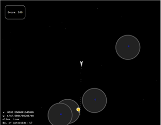

# Description

Space-fleet is the Atari classic "Asteroids" game re-imagined as an MMO game.

The game was initially developed as a personal project during the Codeworks Software Engineering course in 2021, and uses socket.io to communicate with a Node backend game server. It was deployed at Heroku, until free Dynos were removed in 2022.

# Local Install
- Install [Node](https://nodejs.org/en/download/) if required
- Fork this project
- Clone to you local machine: From your command line, in the desired directory, run `git clone https://github.com/djr319/spacefleet`
- Install dependencies: `npm i` from the project root folder

## Configure
- The project will run out of the box on your local machine
- If you would like to host on Heroku, don't forget to point the client to the Dyno:
  - Open `server/views/scripts/socket-client.js`in your code editor
  - comment out line 1 (reference to local server)
  - un-comment line 2 (insert your reference to heroku domain)

# Run
- The server can be started by running `npm run server` from the root folder
- Navigate in browser to http://localhost:5000

# About

- The front end uses canvas API
- The client connects to the backend server with `socket.io`
- The backend creates the gaming environment
- Game phsyics are all vanilla JS to further my knowledge and experience of game design

  

## Further Reading

If you are interested in forking and taking this further, the following libraries may be of interest:

- https://brm.io/matter-js/ (2D physics engine)
- https://threejs.org/ (3D rendering)
- https://phaser.io/ (HTML5 Game framework)
- https://github.com/adambom/bullet.js/ (3D physics engine)
